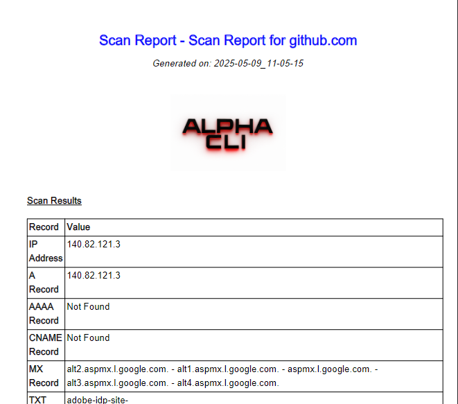

# Alpha CLI (V1.3) - Domain to IP Resolver

  

## Table of Contents
1. [Overview](#overview)
2. [Features](#features)
3. [Installation](#installation)
4. [Usage](#usage)
5. [Development](#development)
6. [Testing](#testing)
7. [Build & Deployment](#build--deployment)
8. [Contributing](#contributing)
9. [License](#license)

## Overview
Alpha CLI is a powerful Java-based command-line utility that resolves domain names to their corresponding IP addresses. It supports various domain formats and provides flexible output options for integration with other tools and scripts.

## Features
- ✅ **DNS Resolution**  
  Supports all major record types (A, AAAA, MX, CNAME, etc.)
- ✅ **SSL Inspection**  
  Detailed certificate information (issuer, expiry, subject)
- ✅ **PDF Reporting**  
  Generate professional PDF reports (`-epdf` option)
- ✅ **Flexible Output**  
  Console, text, and PDF output formats
- ✅ **Cross-Platform**  
  Runs on Windows, Linux, and macOS

### New Dependencies
- iText 7.2.5 (PDF generation)
- Bouncy Castle (SSL handling)

### Prerequisites
- Java JDK 23 or later
- Maven 3.6.3 or later

### Installation Steps
1. **Clone the repository**:
   ```bash
   git clone https://github.com/localho3t/alpha-cli.git
   cd alpha-cli
   ```

2. **Build the project**:
   ```bash
   mvn clean package
   ```

3. **Run the application**:
   ```bash
   java -jar target/alpha-cli-1.0-SNAPSHOT-jar-with-dependencies.jar -d yahoo.com -ip
   ```

## Usage

### Basic Commands
```bash
# Resolve a domain to IP addresses
java -jar alpha-cli.jar -d example.com --ip

# Display help
java -jar alpha-cli.jar --help
```

# DNS Resolver Tool - Command Line Options

## Main Options

| Option        | Short Form | Description                          |
|---------------|------------|--------------------------------------|
| `--domain`    | `-d`       | Specify domain to resolve            |
| `--ip`        | `-ip`      | Display IP addresses for the domain  |
| `--help`      | `-h`       | Show help message                    |

## Record Type Options

| Option  | Description                |
|---------|----------------------------|
| `-A`    | Target A Record            |
| `-AAAA` | Target AAAA Record         |
| `-CNAME`| Target CNAME Record        |
| `-MX`   | Target MX Record           |
| `-NS`   | Target NS Record           |
| `-SOA`  | Target SOA Record          |
| `-TXT`  | Target TXT Record          |
| `-sslc`  | Check Target SSL          |
| `-epdf`       | Export results as PDF                |


### Examples
1. **Simple domain resolution**:
   ```bash
   java -jar alpha-cli.jar -d google.com --ip
   ```

2. **Multiple domains from file** (using xargs):
   ```bash
   cat domains.txt | xargs -I {} java -jar alpha-cli.jar -d {} --ip
   ```

3. **Save output to file**:
   ```bash
   java -jar alpha-cli.jar -d example.com --ip > output.txt
   ```

## Development

### Project Structure
```
alpha-cli/
├── src/
│   ├── main/
│   │   └── java/com/alphacli/
│   │       ├── app/            # Main application classes
│   │       ├── Apps/           # App logic
│   │       └── Argv/           # Command-line argument handling
│   │       └── Utils/           # tools
│   └── test/                   # Unit tests
├── target/                     # Build output
└── pom.xml                     # Maven configuration
```

### Dependencies
- Apache Commons CLI - Command line parsing
- JUnit 5 - Unit testing framework
- Mockito - Mocking framework for tests

### Building from Source
```bash
# Build with tests
mvn clean package

# Build without tests
mvn clean package -DskipTests
```

## Testing

### Running Tests
```bash
mvn test
```

### Test Coverage
To generate test coverage report:
```bash
mvn jacoco:report
```
Open `target/site/jacoco/index.html` in your browser.

## Build & Deployment

### Creating Executable JAR
```bash
mvn clean package
```

### Creating Native Executable (Windows .exe)
Using jpackage (requires JDK 14+):
```bash
jpackage --input target/ \
         --name AlphaCLI \
         --main-jar alpha-cli-1.0-SNAPSHOT-jar-with-dependencies.jar \
         --main-class com.alphacli.app.App \
         --type exe \
         --win-console
```

### Distribution Packages
1. **Windows**:
   - `.exe` installer (via jpackage)
   - Portable ZIP package

2. **Linux/macOS**:
   - `.deb`/`.rpm` packages
   - Portable TAR archive

## Contributing

We welcome contributions! Please follow these steps:

1. Fork the repository
2. Create your feature branch (`git checkout -b feature/AmazingFeature`)
3. Commit your changes (`git commit -m 'Add some AmazingFeature'`)
4. Push to the branch (`git push origin feature/AmazingFeature`)
5. Open a Pull Request

### Coding Standards
- Follow Google Java Style Guide
- Write unit tests for new features
- Document public APIs with Javadoc
- Keep commits atomic and well-described

## License
Distributed under the MIT License. See `LICENSE` for more information.

## Support
For issues and feature requests, please [open an issue](https://github.com/your-repo/alpha-cli/issues) on GitHub.

---

📝 **Note**: This is a production-ready CLI tool designed for system administrators and network engineers. The tool has been tested on Windows 10, Ubuntu 20.04, and macOS Big Sur.

📝 **Note**: The PDF export feature requires write permissions in the execution directory. Reports are saved in `./reports/` by default.